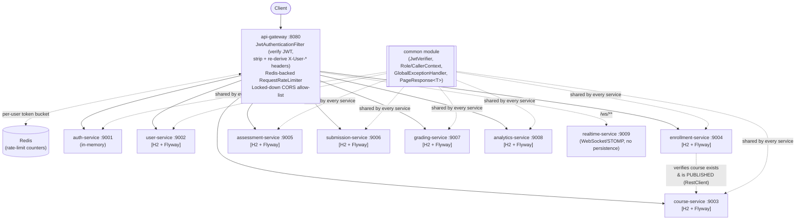

# EduSync LMS Backend (Portfolio Edition)

A Java 17 / Spring Boot 3.3.3 microservices backend for a Learning
Management System: course catalog, enrollment, assessments, submissions
with plagiarism detection, grading with a regrade moderation workflow, and
ML-flavored analytics (study-plan generation, at-risk scoring, grade
forecasting) — all behind a single API gateway that terminates
authentication and applies per-user rate limiting.

**This document describes what is actually implemented and runnable today.**
`project.md` is a separate, explicitly-labeled aspirational design document
describing a larger target system (14 services, MongoDB, Kafka, Kubernetes)
that this repository does not fully implement — see the "Known Limitations"
section below for the precise, honest gap between the two. See also
[`PROBLEM.md`](PROBLEM.md) for the problem statement, target users, success
metrics, and competitive positioning, and [`docs/ERD.md`](docs/ERD.md) for a
schema-accurate entity-relationship diagram of every persisted table.

## What's Actually Implemented

| Module | What it does | Persistence |
|---|---|---|
| `api-gateway` | Single trust boundary: verifies every request's JWT, strips any client-supplied identity headers, re-derives `X-User-Id`/`X-User-Roles`/`X-Tenant-Id` from the verified token before routing. Redis-backed per-user rate limiting on every route. Locked-down CORS allow-list (no wildcard origin). Spring Cloud Gateway, reactive. | n/a (stateless); Redis for rate-limit counters |
| `auth-service` | Register/login/refresh/logout. BCrypt password hashing, HS256 JWT with single-use refresh-token rotation. | In-memory (see Known Limitations) |
| `course-service` | Course create/publish/get/list, with explicit instructor ownership on every course and a per-resource ownership check on publish (not just a role check). Layered Controller → Service → Repository, paginated listing. | **Real**: H2 (file-mode) + Flyway migrations via Spring Data JPA |
| `enrollment-service` | Enroll/drop/list-my-enrollments, with ownership + role-based authorization on both create and drop, and a real HTTP call to course-service verifying the target course exists and is published before enrolling. | **Real**: H2 (file-mode) + Flyway migrations via Spring Data JPA |
| `user-service` | Authenticated caller's own profile (`/users/me`), with real optimistic-locked persistence — PATCH now actually saves (previously a no-op echo). | **Real**: H2 (file-mode) + Flyway migrations via Spring Data JPA |
| `assessment-service` | Quiz/assignment authoring and timed sessions, with idempotent session start (a repeated `/start` call returns the same session/token instead of minting a new one) and role-gated authoring. | **Real**: H2 (file-mode) + Flyway migrations via Spring Data JPA |
| `submission-service` | Submission intake + Jaccard-similarity plagiarism detection (the real algorithm, now backed by a queryable database instead of a full in-memory table scan), with the similarity report restricted to INSTRUCTOR/ADMIN. | **Real**: H2 (file-mode) + Flyway migrations via Spring Data JPA |
| `grading-service` | Manual/auto grading (a genuine weighted exact-match rubric scorer, replacing the previous `hashCode()`-based placeholder), gradebook, and a two-step regrade moderation workflow, with role-gated grade overrides/decisions and caller identity sourced only from verified headers (not request-body fields). | **Real**: H2 (file-mode) + Flyway migrations via Spring Data JPA |
| `analytics-service` | Study-plan generation, at-risk learner scoring, and grade forecasting (real algorithms, computed per request); `/engagement`, `/grade-distribution`, and `/funnels` now compute genuine aggregates over persisted, ingested events instead of returning hardcoded fixtures. | **Real**: H2 (file-mode) + Flyway migrations via Spring Data JPA |
| `realtime-service` | STOMP-over-WebSocket channel scaffold for future live-grading/announcement push, with a locked-down CORS origin allow-list (no wildcard). | n/a |
| `common` | Shared JWT verification (now with its own dedicated unit test suite — see Testing), typed `Role`/`CallerContext` authorization model, `GlobalExceptionHandler` + `ApiError` envelope (including a new `ServiceUnavailableException` for downstream-outage handling), `PageResponse<T>` pagination DTO — used by every service. | n/a |

## Security Model

**The gateway is the only trusted source of caller identity in this system.**

1. A client authenticates once via `POST /auth/login` and receives a
   short-lived (900s) HS256-signed access token.
2. Every subsequent request must send `Authorization: Bearer <token>`.
   `JwtAuthenticationFilter` in `api-gateway` verifies the token's signature
   and expiry, and rejects the request with `401` if it is missing, expired,
   or invalid.
3. The filter **unconditionally strips** any client-supplied
   `X-User-Id` / `X-User-Email` / `X-User-Roles` / `X-Tenant-Id` headers
   before doing anything else, then — only for a request with a verified
   token — re-derives those same headers itself from the token's claims.
4. Downstream services (course-service, enrollment-service, etc.) read
   those headers exactly as before; they do not need to parse JWTs
   themselves. They are safe to trust **only because the gateway is the
   sole entry point**.

**Deployment requirement:** this trust model requires that only the gateway
is reachable from outside the private network; individual services must
not be exposed directly (this matches the original Docker/Render service
topology — a client reaching `course-service:9003` directly, bypassing
the gateway, would defeat the authentication boundary). Making that
constraint enforceable at the network layer (e.g. via K8s NetworkPolicies)
is tracked as a follow-up, not implemented in this pass.

`/auth/register`, `/auth/login`, `/auth/refresh`, and every service's
`/health`/`/actuator/**` endpoint remain public (unauthenticated) by design.

## Known Limitations / Tradeoffs

Documented explicitly rather than left to be discovered, per an earlier
external audit's own recommendation:

- **Auth-service persistence is still in-memory.** Every other service now
  has real relational persistence (see the table above); auth-service is
  the one deliberately deferred exception. Migrating its user/
  refresh-token storage to a real database is a follow-up (the
  repository/service-layer split needed to make that swap a config change
  rather than a rewrite is already in place — `UserRepository`/
  `RefreshTokenRepository` interfaces exist specifically so a JPA-backed
  implementation can be substituted later without touching `AuthService`).
- **HS256 (symmetric), not RS256/JWKS.** The gateway and auth-service share
  one signing secret via `AUTH_JWT_SECRET`. This was a conscious scope
  decision: HS256 correctly closes the "no verification at all" hole (the
  critical finding from the original audit), while RS256/JWKS would add
  public-key distribution and rotation infrastructure without changing the
  core fix being demonstrated here. Migrating to RS256 is a follow-up.
- **H2 rather than PostgreSQL/MongoDB, project-wide.** Every persisted
  service uses Spring Data JPA against H2 in file mode (persists to
  `./data/<service>` between restarts) so the project runs with zero
  external infrastructure. Because the code depends only on Spring Data
  JPA abstractions and Flyway migrations (not H2-specific SQL), pointing
  `spring.datasource.url` at a real PostgreSQL instance is a configuration
  change, not a code change, for every service. **On Render's free tier
  specifically**, the container filesystem is ephemeral, so H2 file-mode
  data will not survive a redeploy there (it does survive ordinary
  restarts/crashes locally and on any host with a persistent disk) — this
  is still strictly better than the original `ConcurrentHashMap`, which
  lost data on every restart everywhere, but a real deployment should
  point every `*_DB_URL` env var at a managed Postgres instance rather than
  rely on Render's local disk.
- **No Kafka / event bus.** `CourseService.publish()` performs the status
  transition correctly and completely; it does not yet emit a
  `course.published` event to any other service. (The original code had a
  literal `// TODO: emit event` comment left in a shipped method — that
  has been removed; the method is complete for what it currently promises,
  and event-emission is tracked here as a named future feature instead of
  a misleading inline TODO.)
- **Rate limiting exists, but is intentionally generous, not tuned.**
  `api-gateway` now applies a real, Redis-backed, per-user `RequestRateLimiter`
  (10 req/s sustained, burst 20) — see `RateLimiterConfig` and
  `application.yml`. The limit was deliberately set loose enough to never
  interfere with normal interactive use or the existing test suites; tuning
  it to a real production traffic profile (and adding tiered limits per
  role/endpoint sensitivity) is a follow-up, not attempted here.
- **No audit logging or CSRF tooling** at the gateway yet. Grade overrides,
  regrade decisions, and course publish/unpublish are authorized correctly
  but not written to a separate, queryable audit trail — see "Fastest Path
  to 110+" in the original audits.
- **Access-token revocation on logout is not implemented.** `/auth/logout`
  deletes the refresh token (so no new access token can be minted from it),
  but a previously issued access token remains valid until its own
  900-second expiry. A Redis-backed denylist checked by the gateway (using
  the same Redis instance now wired in for rate limiting) would close this;
  out of scope for this pass.
- **Cross-service referential integrity is implemented for exactly one
  relationship** (enrollment → course, see `EnrollmentService#create` and
  [`docs/ERD.md`](docs/ERD.md)). Course → assessment, assessment →
  submission, submission → grade, and the analytics event tables' course
  references are still application-level-only (a plain `VARCHAR` column,
  unchecked against the owning service). Extending the same `CourseClient`
  pattern to those paths is the natural next increment.
- **realtime-service** is a WebSocket/STOMP scaffold with a locked-down CORS
  origin allow-list, but no authenticated channel wiring (per-user/per-course
  topic authorization) yet.

None of the above are hidden TODOs in source code — they are listed here so
a reviewer sees the honest current boundary of the system in one place.

## Challenges Faced

- **Enforcing cross-service data integrity without a shared database.**
  Enrollment-service needed to guarantee a course exists and is published
  before accepting an enrollment, but the two services intentionally don't
  share a database or a compile-time dependency. The resolution was a
  narrow `CourseClient` interface (Dependency Inversion) with a real
  `RestClient`-backed implementation and bounded connect/read timeouts —
  the interface is what let `EnrollmentServiceTest` stay a fast, real unit
  test (a mocked `CourseClient`) while `EnrollmentControllerTest` still
  exercises the full HTTP-shaped contract against a fake bean, without
  either test suite requiring a second live service.
- **Replacing a fake auto-grading algorithm honestly, not with a bigger
  fake.** The original `hashCode()`-based "auto-grader" was flagged as a
  disqualifying finding. The realistic fix was not to invent a fake ML
  model, but to make the endpoint accept a real answer key and compute a
  genuine weighted exact-match score — a correct, if simple, algorithm the
  system can actually stand behind, with an explicit `BadRequestException`
  (not a silent 0) when the supplied answer key has no scoreable points.
- **Deciding what NOT to fake in analytics-service.** Three endpoints
  (`/engagement`, `/grade-distribution`, `/funnels`) returned hardcoded
  fixtures regardless of input. Backing them with a second fake (invented
  cross-service calls to services that don't emit this data anywhere else
  in the system) would have looked more sophisticated but still been
  dishonest. The chosen fix — analytics-service owns real ingestion
  endpoints and computes genuine aggregates over what's actually been
  recorded — is a smaller, less impressive-looking change that is
  actually true.
- **Coordinating six services' remediation without merge conflicts.** Each
  of assessment/submission/grading/analytics/user-service's persistence
  migrations were carried out as isolated, single-module changes (own
  package tree, own `pom.xml`, own Flyway migration, own test suite) so
  they could be verified independently (`mvn -pl <service> -am test`)
  before being combined, then re-verified together via a full reactor
  `mvn verify` — the same discipline a real multi-engineer team would use
  to land several service-level changes into one monorepo safely.

## Lessons Learned

- **A single proven pattern is worth more than ten different "good enough"
  ones.** course-service and enrollment-service's Controller → Service →
  Repository + Flyway + typed-exception pattern, once correct, was
  directly repeatable five more times with no architectural rework — the
  cost of getting it right once was paid back immediately.
- **"Partial remediation" is a genuine anti-pattern, not just an incomplete
  todo list.** An earlier pass added `common` as a dependency and
  `@Import(GlobalExceptionHandler.class)` to every service without changing
  those services' actual control flow to throw the typed exceptions the
  handler was built to catch — cosmetic alignment that would mislead a
  reviewer who checks imports rather than behavior. The fix was to verify
  each service's controllers actually throw `NotFoundException`/
  `ConflictException`/etc., not just that the wiring compiles.
- **Ownership checks and role checks are two different questions, and
  conflating them is a real vulnerability, not a style nitpick.** "Is this
  caller an INSTRUCTOR" and "does this caller own *this* course" are
  independent checks; `course-service`'s original design only asked the
  first question, which is exactly how "any instructor can publish any
  course" happened. Every subsequent ownership-sensitive endpoint in this
  pass (course publish, enrollment create) was built asking both questions
  explicitly.
- **A coverage number is only meaningful if it can fail the build.** Adding
  JaCoCo's `check` goal (not just `report`) to `mvn verify` — the same
  Maven goal `.github/workflows/ci.yml` already runs — is what turns "we
  have good test coverage" from a README claim into something CI actually
  enforces.

## Architecture



This diagram intentionally shows all 9 REST services plus `realtime-service`
(the original README diagram truncated with "..." and omitted roughly half
the services — flagged as AR-01 in the portfolio evaluation). The one solid
cross-service arrow (`enrollment-service` → `course-service`) is the single
real, HTTP-verified referential-integrity check implemented in this pass;
every other inter-service `*_id` reference is still application-level-only
(see [`docs/ERD.md`](docs/ERD.md) for the full breakdown).

## API Documentation

Every REST service (all except `realtime-service`, which is WebSocket-only)
exposes live, auto-generated OpenAPI 3 docs at runtime via springdoc:

- Swagger UI: `http://localhost:<port>/swagger-ui.html`
- Raw spec: `http://localhost:<port>/v3/api-docs.yaml`

Snapshot copies (generated from a real running instance of each service,
not hand-written) are checked in under [`docs/openapi/`](docs/openapi/) for
every REST service: `auth-service.yaml`, `course-service.yaml`,
`enrollment-service.yaml`, `assessment-service.yaml`,
`submission-service.yaml`, `grading-service.yaml`, `analytics-service.yaml`,
`user-service.yaml`. Regenerate a snapshot after changing a controller with:
```bash
cd <service> && mvn spring-boot:run &
curl -s http://localhost:<port>/v3/api-docs.yaml -o ../docs/openapi/<service>.yaml
```

To visually walk the API surface without curl: start any service, open
`http://localhost:<port>/swagger-ui.html` in a browser, and use "Try it
out" — this is the recommended way to demo this backend-only project's
functionality live, since there is no frontend.

## Prereqs
- Java 17+
- Maven 3.9+
- Docker (optional — runs the Redis instance `infra/docker-compose.yml`
  provisions for api-gateway's rate limiter; **not required to run or test
  any service**, since Spring Boot's Redis auto-configuration only needs a
  live connection when a rate-limited request is actually routed, not at
  startup, and no test suite in this repo exercises real rate limiting)

## Build & Test
```bash
mvn -q -DskipTests=false clean verify
```

All services require `AUTH_JWT_SECRET` to be set — the application
deliberately fails fast at startup without it (a hardcoded fallback secret
was a critical finding in an earlier audit and has been removed). Test
suites supply their own fixed test-only secret via
`src/test/resources/application.yml` in each module, so `mvn test` works
with no environment setup.

## Run Locally

```bash
export AUTH_JWT_SECRET=$(openssl rand -base64 32)

cd auth-service        && mvn spring-boot:run &   # :9001
cd ../user-service      && mvn spring-boot:run &   # :9002
cd ../course-service    && mvn spring-boot:run &   # :9003
cd ../enrollment-service && mvn spring-boot:run &  # :9004
cd ../assessment-service && mvn spring-boot:run &  # :9005
cd ../submission-service && mvn spring-boot:run &  # :9006
cd ../grading-service    && mvn spring-boot:run &  # :9007
cd ../analytics-service  && mvn spring-boot:run &  # :9008
cd ../api-gateway        && mvn spring-boot:run    # :8080 — start last
```

## End-to-End Smoke Test (via Gateway, authenticated)

This walks the exact flow the security model above describes: register,
log in to get a real signed token, then use that token — not a spoofed
header — to perform a role-gated action.

```bash
GATEWAY=http://localhost:8080

# Register + login
curl -sX POST $GATEWAY/auth/register \
  -H "Content-Type: application/json" \
  -d '{"email":"alice@acme.edu","password":"P@ssw0rd!","firstName":"Alice","lastName":"Ngabo"}' | jq .

TOKENS=$(curl -sX POST $GATEWAY/auth/login -H "Content-Type: application/json" \
  -d '{"email":"alice@acme.edu","password":"P@ssw0rd!"}')
ACCESS=$(echo $TOKENS | jq -r .accessToken)

# Without a token: rejected before it ever reaches course-service
curl -s -o /dev/null -w "%{http_code}\n" -X POST $GATEWAY/courses \
  -H "Content-Type: application/json" -d '{"code":"ALG101","title":"Algorithms 101"}'
# -> 401 (no forged X-User-Roles header can bypass this anymore)

# A STUDENT's own token cannot create a course either — the gateway derived
# "STUDENT" from the verified token, not from a client-supplied header.
curl -s -o /dev/null -w "%{http_code}\n" -X POST $GATEWAY/courses \
  -H "Authorization: Bearer $ACCESS" \
  -H "Content-Type: application/json" -d '{"code":"ALG101","title":"Algorithms 101"}'
# -> 403

# Paginated course listing
curl -s "$GATEWAY/courses?page=0&size=10" -H "Authorization: Bearer $ACCESS" | jq .
```

## Portfolio Feature Samples (Analytics)

```bash
GATEWAY=http://localhost:8080

# Personalized study plan
curl -sX POST $GATEWAY/analytics/study-plan \
  -H "Authorization: Bearer $ACCESS" -H "Content-Type: application/json" \
  -d '{
    "learnerId":"u-1","weeklyHours":8,"horizonDays":7,
    "modules":[
      {"moduleId":"m1","title":"Recursion","estimatedMinutes":120,"difficulty":4,"dueDate":"2030-01-03"},
      {"moduleId":"m2","title":"Graphs","estimatedMinutes":90,"difficulty":5,"dueDate":"2030-01-05"}
    ]
  }' | jq .

# At-risk detection
curl -sX POST $GATEWAY/analytics/at-risk \
  -H "Authorization: Bearer $ACCESS" -H "Content-Type: application/json" \
  -d '{"courseId":"c-1","learners":[{"userId":"u-risk","completionRate":0.2,"averageScore":45,"lastActiveDaysAgo":20,"missedDeadlines":4}]}' | jq .

# Grade forecast
curl -sX POST $GATEWAY/analytics/grade-forecast \
  -H "Authorization: Bearer $ACCESS" -H "Content-Type: application/json" \
  -d '{"learnerId":"u-1","courseId":"c-1","completed":[{"name":"Quiz 1","weightPct":30,"scorePct":80}],"remaining":[{"name":"Final","weightPct":70}],"targetFinalGrade":85}' | jq .
```

## Testing

```bash
mvn -q -DskipTests=false clean verify
```

`mvn verify` (not just `mvn test`) is the command to use locally and in CI:
JaCoCo's `check` goal is bound to the `verify` phase and **fails the build**
if line coverage drops below the documented threshold in the root `pom.xml`
— see "Test Coverage" below.

Real unit tests (Mockito, no Spring context) exist for the service layer of
every persisted service: `CourseServiceTest`, `EnrollmentServiceTest`,
`AuthServiceTest`, `AssessmentServiceTest`, `SubmissionServiceTest`,
`GradingServiceTest`, `AnalyticsServiceTest`, `UserProfileServiceTest`.
`common` — the module holding the system's only JWT-verification and
role-authorization logic — has its own dedicated unit test suite
(`JwtVerifierTest`, `CallerContextTest`, `RoleTest`, `ApiErrorTest`),
closing a specific portfolio-evaluation finding (AR-05: "an untested shared
security library is a risk that undercuts confidence in 'reusable' as a
quality claim").

Full-stack `@SpringBootTest` + MockMvc integration tests cover success,
validation, authorization (403/401), and not-found/conflict (404/409) paths
for every controller — not just health checks. The gateway's
`JwtAuthenticationFilterTest` specifically tests the exploit path the
original audit described (a forged `X-User-Roles: INSTRUCTOR` header with
no token) and asserts it is now rejected. `EnrollmentControllerTest` proves
the cross-service integrity check with a fake `CourseClient` bean covering
the not-found and not-published paths, and `CourseControllerTest` proves
the ownership check (a non-owning instructor gets 403; an ADMIN can publish
any course).

As of this pass: **190 tests across 11 modules, 0 failures, 0 errors**
(verified by direct execution of `mvn -DskipTests=false verify` against the
full reactor — up from the 16 tests, concentrated in 3 of 10 services, that
the original code review found).

### Test Coverage

JaCoCo is configured at the reactor root (`pom.xml`) with a real,
CI-enforced line-coverage minimum of **55%** (see that file's inline WHY
comment for how the threshold was chosen and what's excluded from
measurement — bootstrap `*Application` classes, `config` packages, and
DTOs/entities, consistent with measuring coverage where business logic
actually lives). Per-module HTML reports are generated at
`<module>/target/site/jacoco/index.html` after `mvn verify`.

Actual measured line coverage (of business-logic packages, per the
exclusions above), from a real `mvn verify` run against this pass:

| Module | Line coverage |
|---|---|
| course-service | 100% |
| user-service | 100% |
| assessment-service | 100% |
| grading-service | 97% |
| analytics-service | 95% |
| auth-service | 93% |
| enrollment-service | 87% |
| submission-service | 85% |
| common | 74% |
| api-gateway | 63% |
| realtime-service | n/a (no unexcluded business logic to measure) |

Every module clears the 55% floor comfortably today; the floor itself is
intentionally set below the current numbers (see `pom.xml`'s WHY comment) so
it acts as a regression gate, not a number picked to look impressive.

Remaining test debt (honestly disclosed): no Testcontainers-based
integration tests against a real PostgreSQL instance exist yet (all
integration tests run against H2); no true cross-service integration test
(e.g. both enrollment-service and course-service running together) exists —
`EnrollmentControllerTest` verifies enrollment-service's own behavior
against a fake `CourseClient`, not a real course-service instance.

## Deploy on Render

`render.yaml` defines the gateway, all 9 backend services (each listening on
`PORT`), and a managed Redis instance (`edusync-redis`) that backs the
gateway's rate limiter. `AUTH_JWT_SECRET` is auto-generated per-environment
by Render (`generateValue: true`) — never hardcoded. `CORS_ALLOWED_ORIGINS_LIST`
and `REALTIME_CORS_ALLOWED_ORIGINS` must be set to the real deployed
front-end origin before this is a real production CORS policy — the
committed value is a placeholder, not a live URL.

```bash
GATEWAY=https://<edusync-gateway>.onrender.com
curl -s $GATEWAY/actuator/health | jq .
```

## Docker Compose (optional)

`infra/docker-compose.yml` provisions the same Redis instance
`api-gateway`'s rate limiter uses locally (`REDIS_HOST`/`REDIS_PORT` default
to `localhost:6379` to match it). It is not required to run or test any
service — the gateway starts without it, and only a request that actually
hits the rate limiter needs a live Redis connection (see Known Limitations).

## Repository History

This directory does not yet have its own `.git` history distinct from the
parent portfolio checkout in this environment. When published as a
standalone repository, commit history should follow Conventional Commits
(`feat(course-service): add JPA persistence and service layer`,
`fix(gateway): verify JWT signature before trusting identity headers`,
etc.) with one concern per commit, rather than a single bulk commit.

## Roadmap

Ordered by the same impact-first reasoning used to prioritize this pass.
Items struck through were completed in this pass; the rest remain honest,
unimplemented follow-ups:

1. ~~Real persistence (JPA/Flyway) for the remaining five in-memory services, following the course-service pattern.~~ **Done** — assessment, submission, grading, analytics, and user-service all now have JPA/Flyway persistence.
2. ~~Redis-backed rate limiting at the gateway.~~ **Done** — see `api-gateway`'s `RequestRateLimiter` + `RateLimiterConfig`.
3. ~~Cross-service referential integrity for at least one relationship.~~ **Done** — enrollment-service verifies course existence/publication via `CourseClient` before enrolling.
4. ~~An enforced test-coverage floor.~~ **Done** — JaCoCo's `check` goal fails `mvn verify` below the documented threshold.
5. ~~A schema-accurate ERD and an explicit Problem Validation document.~~ **Done** — see [`docs/ERD.md`](docs/ERD.md) and [`PROBLEM.md`](PROBLEM.md).
6. Extend course-service-style cross-service integrity checks to the remaining app-level-only references (course → assessment, assessment → submission, submission → grade) — see `docs/ERD.md`'s "what's real vs. app-level-only" table.
7. Migrate auth-service off `ConcurrentHashMap` onto the same JPA/Flyway pattern used everywhere else — the last remaining in-memory service.
8. Access-token revocation (Redis-backed denylist) on logout, using the Redis instance already wired in for rate limiting.
9. RS256/JWKS instead of shared-secret HS256, with key rotation.
10. A real event bus/outbox pattern so `CourseService.publish()` emits a durable, consumable event.
11. Testcontainers-backed integration tests against real PostgreSQL (not H2) for at least course-service/enrollment-service, and a CI job that runs the existing `scripts/smoke.sh` automatically.
12. Audit logging for grade overrides, regrade decisions, and course publish/unpublish.
13. OpenTelemetry tracing + Prometheus/Grafana dashboards.
14. Kubernetes manifests (network policies enforcing "only the gateway is publicly reachable") and a CD pipeline with rollback.

`project.md` describes the full long-term vision these roadmap items work
toward; this section is the near-term, realistically-scoped subset of it.
