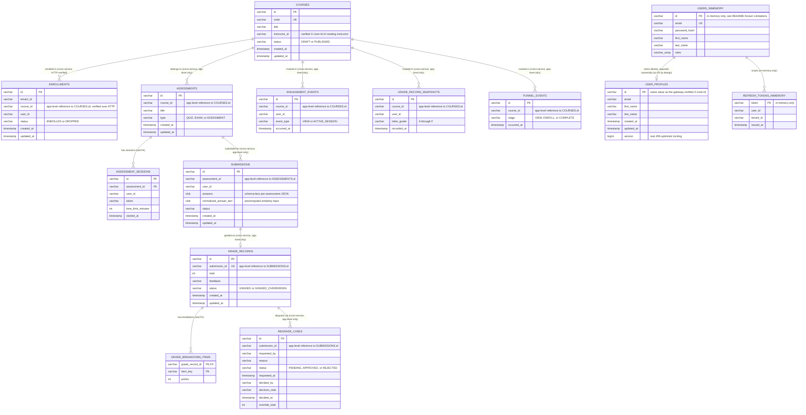

# Entity-Relationship Diagram

WHY this document exists: DB-01 in the portfolio evaluation found "no
entity-relationship diagram (image, Mermaid, or otherwise) exists anywhere
in the repository." This is a real, schema-accurate diagram generated by
reading every service's actual Flyway migration under
`*/src/main/resources/db/migration/` — not an aspirational model. Each
table below corresponds 1:1 to a `CREATE TABLE` statement that Flyway
applies and Hibernate then validates against (`ddl-auto: validate`), so this
diagram cannot silently drift from the real schema without a migration
changing first.

## Scope note: one database per service, not one shared schema

This is a microservices system, not a monolith with one database — each
service listed below owns and migrates its **own** H2 database
independently (`course-service` cannot query `enrollment-service`'s tables
directly, and vice versa). The dotted cross-service lines in the diagram
represent **application-level references validated over HTTP**, not SQL
foreign keys — a real foreign key cannot span two separate database
instances. See `EnrollmentService#create`'s call to `CourseClient` for the
one place this cross-service integrity is actually enforced in code today.

## What's real vs. what's app-level-only vs. what's not yet persisted

| Relationship | Enforcement today |
|---|---|
| `ASSESSMENTS` → `ASSESSMENT_SESSIONS` | **Real SQL foreign key** (`fk_assessment_sessions_assessment`) — both tables live in assessment-service's own database. |
| `GRADE_RECORDS` → `GRADE_BREAKDOWN_ITEMS` | **Real SQL foreign key**, `ON DELETE CASCADE` — both tables live in grading-service's own database. |
| `COURSES` → `ENROLLMENTS` | **Verified over HTTP at write time.** `EnrollmentService#create` calls `course-service` via `CourseClient` before persisting an enrollment, and rejects the request (404/409) if the course doesn't exist or isn't published — this is the one cross-service integrity check implemented in this pass (closes DB-02 / Critical Risk 4). |
| `COURSES` → `ASSESSMENTS`, `ASSESSMENTS` → `SUBMISSIONS`, `SUBMISSIONS` → `GRADE_RECORDS`, `GRADE_RECORDS` → `REGRADE_CASES`, `COURSES` → analytics event tables | **Application-level reference only, not yet HTTP-verified.** These `*_id` columns are plain `VARCHAR`s with no cross-service existence check today — extending the same `CourseClient`-style verification to these paths is the natural next increment, tracked in README "Known Limitations," not hidden. |
| `USERS_INMEMORY` → `USER_PROFILES` | **Same identity value, deliberately no relationship of any kind** — auth-service and user-service intentionally own separate data (credentials vs. profile) and must not depend on each other's schema (see `V1__create_user_profiles_table.sql`'s WHY comment). |
| `USERS_INMEMORY` → `REFRESH_TOKENS_INMEMORY` | Real in application logic (`AuthService`), but **not yet backed by a real table** — auth-service is still `ConcurrentHashMap`-based (see README "Known Limitations"); shown here in the diagram specifically so this gap is visible in the data model, not just in prose. |
